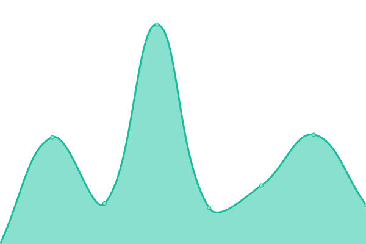

# [📈 Live Status](https://ainize-team.github.io/uptime): <!--live status--> **🟩 All systems operational**

This repository contains the open-source uptime monitor and status page for [Ainize](https://www.ainize.ai/), powered by [Upptime](https://github.com/upptime/upptime).

With [Upptime](https://upptime.js.org), you can get your own unlimited and free uptime monitor and status page, powered entirely by a GitHub repository. We use [Issues](https://github.com/ainize-team/uptime/issues) as incident reports, [Actions](https://github.com/ainize-team/uptime/actions) as uptime monitors, and [Pages](https://ainize-team.github.io/uptime) for the status page.

<!--start: status pages-->
<!-- This summary is generated by Upptime (https://github.com/upptime/upptime) -->
<!-- Do not edit this manually, your changes will be overwritten -->
<!-- prettier-ignore -->
| URL | Status | History | Response Time | Uptime |
| --- | ------ | ------- | ------------- | ------ |
|  [AI Network](https://ainetwork.ai) | 🟩 Up | [ai-network.yml](https://github.com/ainize-team/uptime/commits/HEAD/history/ai-network.yml) | 

 1394ms
     
 | 

<a href="https://ainize-team.github.io/uptime/history/ai-network">100.00%</a>
    

|  [Ainize](https://ainize.ai) | 🟩 Up | [ainize.yml](https://github.com/ainize-team/uptime/commits/HEAD/history/ainize.yml) | 

 351ms
     
 | 

<a href="https://ainize-team.github.io/uptime/history/ainize">100.00%</a>
    

|  [TabTab (KubeCon)](https://kubecon-tabtab-ainize-team.endpoint.ainize.ai) | 🟩 Up | [tab-tab-kube-con.yml](https://github.com/ainize-team/uptime/commits/HEAD/history/tab-tab-kube-con.yml) | 

 934ms
     
 | 

<a href="https://ainize-team.github.io/uptime/history/tab-tab-kube-con">100.00%</a>
    

|  [aFan (JP)](https://afan.ai/ja) | 🟩 Up | [a-fan-jp.yml](https://github.com/ainize-team/uptime/commits/HEAD/history/a-fan-jp.yml) | 

 434ms
     
 | 

<a href="https://ainize-team.github.io/uptime/history/a-fan-jp">100.00%</a>
    

|  [Common Computer](https://comcom.ai) | 🟩 Up | [common-computer.yml](https://github.com/ainize-team/uptime/commits/HEAD/history/common-computer.yml) | 

 341ms
     
 | 

<a href="https://ainize-team.github.io/uptime/history/common-computer">100.00%</a>
    

<!--end: status pages-->

[**Visit our status website →**](https://ainize-team.github.io/uptime)

## 📄 License

- Powered by: [Upptime](https://github.com/upptime/upptime)
- Code: [MIT](./LICENSE) © [Ainize](https://www.ainize.ai/)
- Data in the `./history` directory: [Open Database License](https://opendatacommons.org/licenses/odbl/1-0/)
